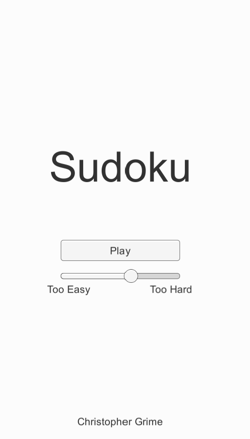

# Sudoku

> Exercise for your brain! Try a Sudoku puzzle! Built using Unity and C#

## Description

Sudoku is a famous logic-based puzzle. The objective is to fill a 9x9 board with each row, column, and 3x3 grid containing the numbers 1 - 9. Each row, column, and 3x3 grid must only contain one of each number. The fewer clues the initial puzzle has the more challenging the Sudoku is to solve.

I decided to create this application after having some trouble solving the Sudoku Hackerranck problem. I was having a hard time understanding how many of the posted solutions worked. The algorithm used to solve Sudoku puzzles is a recursive backtracking algorithm. Creating this application helped break down the problem and I now better understand how recursive backtracking works.

The development of Sudoku allowed me to improve my programming knowledge, in particular recursion. I also practiced C# programming.

## Features

- Generates a new valid Sudoku grid using a recursive backtracking function
- ~Generates a puzzle from the Sudoku grid with a unique solution~ Still working this out
- A slider allows the user to determine the difficulty

## Technologies

- Unity 2019.4
- C# 

## Screenshots

Difficulty Settings

## Future Development

- demonstrate how backtracking work
- How to play section
- Track scores
- Add hi-scores 

---

[chrisgrime.com](https://chrisgrime.com)  
[chris@chrisgrime.com](mailto:chris@chrisgrime.com)  
[linkedin/in/grimechristopher](https://linkedin/in/grimechristopher)  

